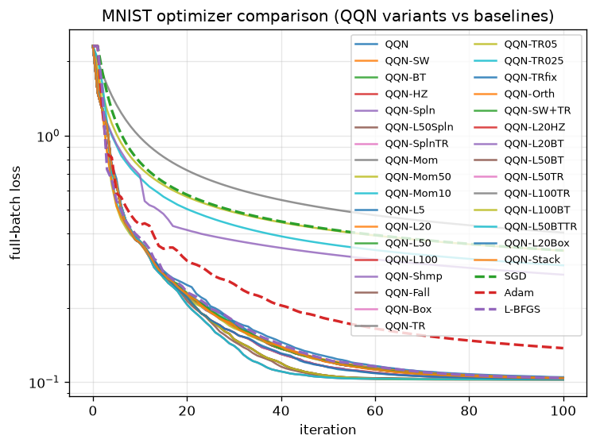

# qqn-jax

**Quasi-Quadratic-Newton (QQN)** optimizer, natively implemented in
[JAX](https://github.com/google/jax) and packaged as a drop-in
[Optax](https://github.com/google-deepmind/optax) `GradientTransformation`.

> **Now fully migrated to Optax.** QQN is exposed as a standard Optax
> optimizer, so it slots directly into any Optax-based training loop. Under
> the hood every component — the L-BFGS oracle, the line search, and the
> outer solver loop — is written as pure, functional JAX code. This means the
> entire optimizer is end-to-end differentiable and composes seamlessly with
> `jit`, `vmap`, `pmap`, and `grad`.

---

## What is QQN?

QQN combines the **robustness of steepest descent** with the **efficiency of
L-BFGS** by searching along a quadratic interpolation path rather than a
single fixed direction:

```
d(t) = t(1 - t)(-∇f) + t²(-H∇f)
```

| `t` | Direction | Behavior |
|-----|-----------|----------|
| `t = 0` | `-∇f`  | pure steepest descent |
| `t = 1` | `-H∇f` | pure L-BFGS direction |
| `0 < t < 1` | blend | adaptive mix of both |

A line search over this single scalar `t` automatically discovers the right
blend of the **gradient**, the L-BFGS **oracle**, and the resulting **search**
step at every iteration — no manual tuning of the trade-off required.

---

## Installation

```bash
pip install qqn-jax
```

Or from source:

```bash
git clone https://github.com/example/qqn-jax
cd qqn-jax
pip install -e ".[dev]"
```

Requires Python ≥ 3.10 and recent
[JAX](https://github.com/google/jax) (`jax`, `jaxlib`) and
[Optax](https://github.com/google-deepmind/optax) installations.

---

## Quick Start

QQN is a regular Optax `GradientTransformation`. Because line searches need to
evaluate the objective, use it together with Optax's value-and-grad helpers:

```python
import jax
import jax.numpy as jnp
import optax
from qqn_jax import qqn

def rosenbrock(x):
    return jnp.sum(100.0 * (x[1:] - x[:-1]**2)**2 + (1.0 - x[:-1])**2)

opt = qqn(history_size=10, line_search="strong_wolfe")
value_and_grad = optax.value_and_grad_from_state(rosenbrock)

@jax.jit
def step(params, state):
    value, grad = value_and_grad(params, state=state)
    updates, state = opt.update(
        grad, state, params, value=value, grad=grad, value_fn=rosenbrock
    )
    params = optax.apply_updates(params, updates)
    return params, state

params = jnp.array([-1.2, 1.0])
state = opt.init(params)
for _ in range(500):
    params, state = step(params, state)

print(params)  # ~ [1.0, 1.0]
```

### Convenience solver

For the common "just optimize this function" case, a thin `QQN` wrapper drives
the Optax transformation through a `lax.while_loop` for you:

```python
from qqn_jax import QQN

solver = QQN(rosenbrock, maxiter=500, tol=1e-6)
params, state = solver.run(jnp.array([-1.2, 1.0]))

print(params)        # ~ [1.0, 1.0]
print(state.iter)    # iterations taken
print(state.value)   # final objective value
```

---

## JAX Acceleration

Because the transformation is pure and functional, it is a first-class JAX
citizen:

```python
import jax

# JIT-compile the whole optimization run
params, state = jax.jit(solver.run)(x0)

# Solve from many starting points in parallel (single device)
params, states = jax.vmap(solver.run)(x0_batch)

# Scale across devices
params, states = jax.pmap(solver.run)(x0_sharded)

# Differentiate *through* the optimizer (e.g. meta-learning / bilevel)
grads = jax.grad(lambda x0: solver.run(x0)[1].value)(x0)
```

No host-side Python loops, no in-place mutation — every iteration is
expressed with `lax.while_loop`/`lax.scan`, so compilation happens once and
runs at native speed.

---

## Key Components

| Component | Role | Module |
|-----------|------|--------|
| **Gradient** | steepest descent `-∇f` | `solver.py` |
| **Oracle**   | L-BFGS `-H∇f` (Optax `scale_by_lbfgs`) | `lbfgs.py` |
| **Search**   | line search over `d(t)` (Optax `scale_by_zoom_linesearch` / `scale_by_backtracking_linesearch`) | `line_search.py` |

QQN is assembled from Optax primitives via `optax.chain`, reusing Optax's
battle-tested L-BFGS and line-search implementations rather than reinventing
them.

The **line search is a first-class component**. It navigates the
one-dimensional space of direction blends defined by `d(t)` and enforces
sufficient decrease (Armijo) and curvature (strong Wolfe) conditions, so the
chosen step is always provably productive.

---

## Configuration

```python
qqn(
    history_size=10,            # L-BFGS memory m
    line_search="strong_wolfe", # or "backtracking"
    t_grid=None,                # candidate interpolation params for d(t)
)

QQN(
    fun,                        # objective f(params, *args) -> scalar
    maxiter=100,                # max iterations
    tol=1e-5,                   # gradient-norm tolerance
    history_size=10,            # L-BFGS memory m
    line_search="strong_wolfe", # or "backtracking"
    has_aux=False,              # fun returns (value, aux)
    t_grid=None,                # candidate interpolation params for d(t)
)
```

All arguments are static configuration; both `opt.update` and `solver.run`
are fully traceable and can be transformed by any JAX transformation.

---

## Algorithm

See [`algorithm.md`](algorithm.md) for a detailed description of the method,
its theoretical guarantees, and the central role of the line search.

---

## Results

Run [`examples/mnist_comparison.py`](examples/mnist_comparison.py) to quickly
validate the default configuration against common Optax baselines:

```text
optimizer     final_loss   iters   train_acc   test_acc   time(s)
-----------------------------------------------------------------
QQN         6.342553e-03      66      1.0000     0.9820     0.417
SGD         4.421039e-02     100      0.9913     0.9860     0.224
Adam        1.233064e-02     100      0.9993     0.9840     0.211
L-BFGS      6.342511e-03     100      1.0000     0.9820     1.273
```



This is a computational demonstration of QQN's hybrid behavior: it reaches the
**same final loss as L-BFGS**, but in **fewer iterations and less wall-clock
time** by leaning on the gradient direction whenever the quasi-Newton oracle
is less reliable — all while running entirely inside the JAX runtime and using
the same Optax interface as the baselines it is compared against.

---

## Citing

If you use `qqn-jax` in academic work, please cite the project (see
[`CITATION.cff`](CITATION.cff)).

## License

Apache 2.0
