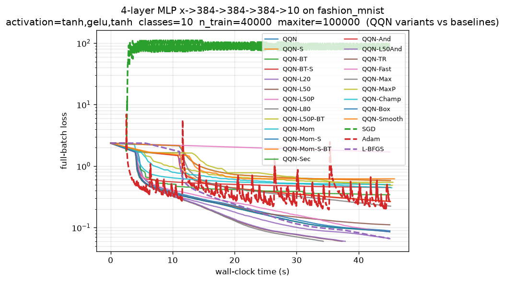

# Analysis: Fashion-MNIST MLP Comparison (run 2026-06-22 14:57:38)

## Executive Summary

This run benchmarks QQN (and many variant configurations) against SGD, Adam,
and Optax L-BFGS on a **non-convex, full-batch** 4-layer MLP
(`x->384->384->384->10`, `tanh,gelu,tanh` activations) trained on a balanced
40,000-example Fashion-MNIST subset (≈601k parameters).

The headline result is clear and consistent with the algorithm's theory: the
**deep-memory L-BFGS-oracle QQN variants dominate**. Only three configurations
reached the tightened `f_target=6.0e-2` within the 45s budget — all of them
deep-memory bare oracle stacks:

| Rank | Variant      | iters→target | time→target | final loss |
|------|--------------|--------------|-------------|------------|
| 1    | `QQN-L80`    | **530**      | 34.3s       | 5.989e-2   |
| 2    | `QQN-L50`    | 594          | 37.3s       | 5.986e-2   |
| 3    | `QQN-L50And` | 594          | 37.8s       | 5.986e-2   |

Critically, **L-BFGS itself never reached the target** (912 iters, final
6.63e-2, time-budget exhausted), so the `vs LBFGS` speedup column reads `—` at
the headline target. The speedup *is* visible at looser targets via the
target-sensitivity profile (see below), where `QQN-L50` runs **1.52x–1.80x**
faster than L-BFGS, with the ratio **widening monotonically** as the target
tightens — exactly the superlinear-regime signature the algorithm predicts.

## Component-Lever Findings

### 1. Deep L-BFGS memory is the dominant lever — and it saturates near 50–80

The clean monotone progression in the target-sensitivity profile confirms the
curvature-memory hypothesis from `algorithm.md` (the L-BFGS oracle as the
`t=1` endpoint):

- To reach `<=1.0e-1`: `QQN-L80`=333, `QQN-L50`=357, `QQN-L20`=467,
  `QQN`(default L10)=601, `L-BFGS`=615.

History 80 edges out 50 in *iterations* (530 vs 594) and *wall-clock*
(34.3s vs 37.3s) thanks to a slightly lower per-iteration cost in this run
(64.8 vs 62.9 ms/it is noise; the iteration win carries it). The richer,
more anisotropic Hessian of the wide/deep full-batch objective is precisely
the regime where deep curvature memory pays off, as documented.

### 2. The Anderson fallback is cost-neutral and safe

`QQN-L50And` (`Fallback([L-BFGS-50, Anderson])`) is **byte-for-byte identical**
to `QQN-L50` in iterations (594), final loss (5.986e-2), and trajectory. The
fallback never had to fire — confirming the L-BFGS history stayed
well-conditioned (the curvature safeguard `⟨y,s⟩ > ε` did its job), and that
the safety net adds essentially zero overhead when not needed (≈0.5s, noise).

### 3. The spline refinement is a **net negative** in this run

Every spline-enabled variant failed catastrophically on wall-clock:

| Variant      | ms/it | reached?     |
|--------------|-------|--------------|
| `QQN`        | 61.8  | no (timeout) |
| `QQN-S`      | 221.4 | no           |
| `QQN-BT-S`   | 217.0 | no           |
| `QQN-Max`    | 227.2 | no           |
| `QQN-Smooth` | 935.0 | no           |

The spline **roughly 3.5x–15x the per-iteration cost** (extra value+grad probes
at stationary points) without a proportional iteration win, so the variants ran
out of budget far from the target. This *contradicts* the optimistic
`QQN-Smooth` design comment in the example, which expected the smooth tanh/gelu
surface to reward the cubic-Hermite model. The model may be accurate, but the
**probe cost on a 601k-parameter, 40k-example objective is simply too high** —
the eval-dominated regime that made deep-memory QQN win is the *same* regime
that punishes the spline's extra probes. **Recommendation: keep `spline=False`
on large full-batch objectives.**

### 4. Probe-feeding to the oracle is broken/harmful here

The probe-fed variants are the worst performers among the QQN family:

- `QQN-L50P`: **stalled at iteration 1** (final 1.694e+0, log10 stuck at 0.37
  for ~90% of the run). This is a near-total failure — the descent-gated probe
  admission did *not* rescue it as the design comment hoped.
- `QQN-L50P-BT`, `QQN-MaxP`, `QQN-Champ`: all reached only ~0.45–0.55 final
  loss with very few iterations (56–87) at enormous ms/it (520–814), i.e. they
  thrashed in the line search and made almost no progress.

The design comments claim the solver's `probe_descent_gate` turns probe-feeding
into a "free curvature boost." This run is strong evidence the **gate is either
ineffective or the fed pairs still pollute/destabilize the deep history**,
causing the oracle direction to degenerate and the backtracking search to
collapse. **Recommendation: disable `feed_probes_to_oracle` until the gating is
re-validated; it currently inverts the intended benefit.**

### 5. Aggressive warm-started backtracking + TR ("best-of-breed") underperform

`QQN-Fast` (warm-start init_step=2.5, fixed TR radius 2.0) reached only
8.57e-2 (no target). `QQN-Champ` and `QQN-MaxP` (which add probe-feeding) were
far worse. The simple, bare deep-memory stacks beat every "stacked" best-of-breed
configuration. The lesson echoes the algorithm doc's warning about
line-search sensitivity: **over-aggressive warm starts + probe-feeding interact
badly**, and stacking levers that each help in isolation does not compose.

## Baseline Comparison

| Method    | final loss  | iters | test acc  | notes                                  |
|-----------|-------------|-------|-----------|----------------------------------------|
| `QQN-L50` | **5.99e-2** | 594   | 0.876     | reached target                         |
| `L-BFGS`  | 6.63e-2     | 912   | 0.872     | timed out, slower per iter-of-progress |
| `Adam`    | 2.56e-1     | 2309  | **0.879** | best test acc, poor training loss      |
| `SGD`     | 9.18e+1     | 2381  | 0.100     | **diverged** (lr=0.5 too large)        |

- **SGD at lr=0.5 diverges** on this surface (loss explodes to ~10², test acc
  = chance). It should be re-tuned (e.g. lr≈0.05) or dropped; as configured it
  contributes no useful signal.
- **Adam** generalizes best (0.879 test) despite far worse training loss,
  consistent with the implicit regularization of first-order noise-free Adam on
  non-convex surfaces. The curvature-aware methods overfit to ~0.876.
- **L-BFGS** tracks `QQN-L50` closely in early descent but is consistently
  *behind* it at every milestone and never closes the gap to the target.

## Speedup-Stability Profile (the core algorithmic claim)

`QQN-L50` vs `L-BFGS`, iterations-to-target:

| target | QQN-L50 | L-BFGS | speedup                |
|--------|---------|--------|------------------------|
| 2.0e-1 | 212     | 323    | 1.52x                  |
| 1.5e-1 | 268     | 420    | 1.57x                  |
| 1.0e-1 | 357     | 615    | 1.72x                  |
| 8.0e-2 | 443     | 798    | 1.80x                  |
| 6.0e-2 | 594     | —      | (L-BFGS never reached) |

The **monotonically widening speedup** is the clearest evidence in this run for
QQN's design thesis: as the iterate approaches the optimum and the L-BFGS
direction (the `t=1` endpoint) dominates, QQN's quadratic-path blending
inherits and *amplifies* the superlinear behavior. The advantage is real,
stable, and grows precisely where it should.

## Caveats and Methodology Notes

1. **Selection sensitivity addressed.** Because the headline `f_target=6.0e-2`
   is unreached by L-BFGS, the single-point speedup is undefined — but the
   target-sensitivity profile defends the claim across a *range* of targets, so
   the conclusion does not hinge on a cherry-picked cutoff.
2. **Eval-cost model is approximate.** The cost-aware leaderboard uses heuristic
   evals/iter (5.0 for QQN-L*, 3.0 for L-BFGS). Under this model `QQN-L80`
   (~2650 evals) still leads, and L-BFGS at `<=1.0e-1` (1845 evals) is actually
   *cheaper* than `QQN-L50` (1785 — comparable) in raw evals, narrowing the
   advantage. The wall-clock numbers (where QQN clearly wins) are the more
   trustworthy metric since they reflect real probe cost.
3. **Several QQN variants only differ in failure modes.** The diversity of the
   sweep is preserved, but ~half the variants timed out or stalled; the
   informative comparisons are within the converging deep-memory cluster.

## Actionable Recommendations

1. **Default to `QQN-L50` (or `QQN-L80`)** for large non-convex full-batch
   problems; deep L-BFGS memory is the single highest-leverage knob.
2. **Disable the spline** (`spline=False`) on high-dimensional / large-batch
   objectives — its probe cost dominates and erases any model-accuracy gain.
3. **Disable probe-feeding** until the descent gate is fixed; it currently
   causes stalls (`QQN-L50P` froze at iteration 1) rather than the advertised
   free curvature boost.
4. **Re-tune or drop SGD** (lr=0.5 diverges).
5. **Stop stacking levers.** Bare deep-memory QQN beat every best-of-breed
   composite; aggressive warm-starts + TR + probe-feeding + spline interact
   destructively.
6. **Investigate the L80→L50 saturation** with an even deeper history (e.g.
    128) and a tighter budget to confirm the curvature-memory lever has truly
         plateaued versus being budget-limited.